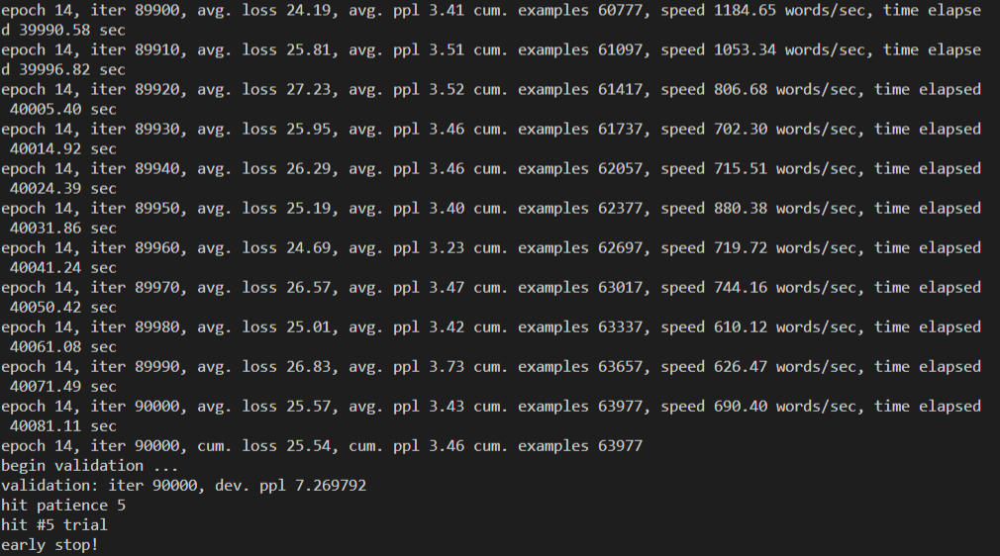
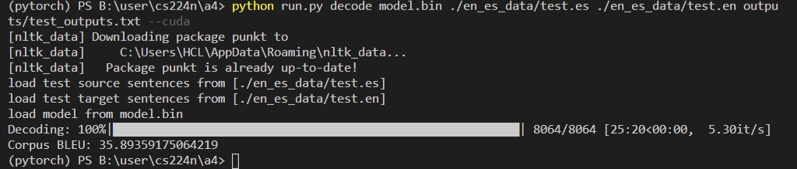
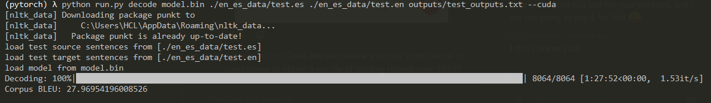

# Stanford CS 224n Natural Language Processing with Deep Learning

Self study on Stanford CS 224n, Winter 2020. Special thanks to Stanford and Professor Chris Manning for making this great resources online and free to the public. No access to autograder, thus no guarantee that the solutions are correct.

[Lecture Videos, CS 224n, Winter 2019](https://www.youtube.com/playlist?list=PLoROMvodv4rOhcuXMZkNm7j3fVwBBY42z)

[Lecture slides, CS 224n, Winter 2019](./slides)

[Lecture notes, CS 224n, Winter 2019](./notes)

## Assignment 1 :heavy_check_mark:
Constructed count vectorized embeddings using co-occurance matrix and used Gensim word2vec to study predictions and language biases.

## Assignment 2 :heavy_check_mark:
Implemented and trained word2vec in Numpy.

Written: [Understanding word2vec](./a2/a2_written.pdf)

Coding: [Implementing word2vec](./a2/README.md)

## Assignment 3 :heavy_check_mark:

[Written and Coding](./a3/README.md)

## Assignment 4 :heavy_check_mark:

Coding: [Neural Machine Translation with RNN](./a4/README.md)

Left local Windows 10 machine with RTX 2080 Ti training overnight. Hit early stopping at around 11 hours. Test BLEU score 35.89.

Written: [Analyzing NMT Systems](./a4/a4_written.pdf)

## Assignment 5 Public :heavy_check_mark:

Trained using `batch_size=64` vs default 32, and set `max_epoch=60` vs default 30 on a local RTX 2080 Ti. GPU memory at 10/11GB. Training reached maximum number of epochs after 34 hours, with training loss at the low 70s and validation perplexity at 59. Average words per second is around 2000 words per second. Test BLEU score 27.96. 

Coding: [Neural Machine Translation with RNN](./a5_public/README.md)

Written: [Neural Machine Translation with RNN](./a5_public/a5_written.pdf)

## LICENSE
All slides, notes, assignments, and provided code scaffolds are owned by Stanford University.
