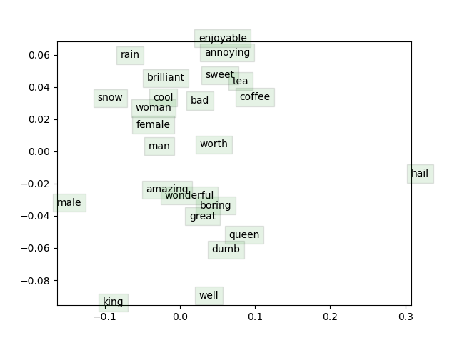

# Stanford CS 224n Natural Language Processing with Deep Learning

Self study on Stanford CS 224n, Winter 2020. 

[Lecture Videos, CS 224n, Winter 2019](https://www.youtube.com/playlist?list=PLoROMvodv4rOhcuXMZkNm7j3fVwBBY42z)

[Lecture slides, CS 224n, Winter 2019](./slides)

[Lecture notes, CS 224n, Winter 2019](./notes)

Special thanks to Stanford, Professor. Manning for making this great resources online and free to the public.

## Assignment 1 :heavy_check_mark:
Constructed count vectorized embeddings using co-occurance matrix and used Gensim word2vec to study predictions and language biases.

## Assignment 2 :heavy_check_mark:
Implemented and trained word2vec in Numpy.

### Written: [Understanding word2vec](./a2/a2_written.pdf)

### Coding: [Implementing word2vec](./a2/README.md)

## Assignment 3

## Assignment 4

## Assignment 5 Public

